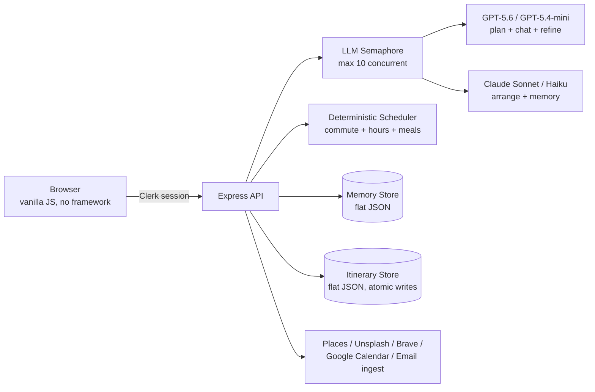

# YunHai.io

**Plan trips that actually happen.**

[](https://yunhai.io)    

YunHai is a full-stack AI travel planner: tell it your cities, dates, and taste, and it generates a day-by-day itinerary — real venues, real opening hours, real commute times — then keeps it internally consistent as you edit it. It's live in production at **[yunhai.io](https://yunhai.io)**.

This README is a tour of the engineering, not just the feature list. The interesting part isn't "an app that calls an LLM" — it's the parts that make LLM output trustworthy enough to hand someone their actual vacation.

## Why this isn't a wrapper around one API call

- **Four models, one job each, one budget.** Itinerary generation, chat, scheduling, and preference memory each go to a different model chosen for that job — GPT-5.6 for activity planning, GPT-5.4-mini for chat and activity refinement, Claude Sonnet for auto-arrange, Claude Haiku for fast profile/memory summarization — all metered through one global semaphore that caps the app at 10 concurrent LLM calls regardless of provider, with cities planned three at a time. See [`src/middleware/llmSemaphore.js`](src/middleware/llmSemaphore.js) and [`src/claude.js`](src/claude.js).

- **The scheduler doesn't trust the LLM to do arithmetic.** Auto-arrange splits judgment from math: the model's only job is deciding *which day* each activity belongs on ([`arrangePromptDirect.js`](src/services/arrangePromptDirect.js)); a deterministic scheduler ([`arrangeScheduler.js`](src/services/arrangeScheduler.js)) then does everything else — commute-minimizing ordering (brute-force for small days, nearest-neighbor above), meal-window anchoring, opening-hours checks, and concrete time assignment. Because the model never emits a time, a scheduling conflict is structurally impossible, not just unlikely — there's no repair loop patching bad output after the fact. The whole deterministic core is unit-tested with zero API keys.

- **It remembers you, without a vector database.** [`src/memory/`](src/memory/) is a small A-MEM/Mem0-style memory layer: synchronous, LLM-free retrieval (`recall()`) ranks stored preferences and constraints by relevance for the current prompt, while a detached background call (`observe()`) reconciles new signals into that store — deciding to add, update, or delete a memory instead of just appending. It's the seam every LLM call reads from, so a preference stated once in chat shows up later in planning, chat, and refinement.

- **Trip Health is a real validator, not a vibe check.** [`src/tripHealth.js`](src/tripHealth.js) checks the actual itinerary for overlapping activities, missing times, and unbooked reservations, and turns that into a status (`Ready` / `Conflicts found` / `Needs booking`) plus an actionable checklist — the same kind of consistency pass a compiler runs, applied to a travel plan.

- **Real integrations, not stubs.** One-way Google Calendar export with duplicate-safe event fingerprinting so re-syncing never creates dupes; a per-user email forwarding address that parses forwarded flight/hotel/car confirmations straight into the trip; Brave Search routed by task type to stay inside a free quota; Google Places + Unsplash for photos, quota-aware and cached.

## Architecture



The 5-step planning flow (Cities → Activities → Arrange → Review → Trip Health) is served by one Express app with routes under [`src/routes/`](src/routes/), all gated behind Clerk auth. State lives client-side in `localStorage` and syncs to the server on sign-in.

## Deliberate tradeoffs

Every one of these was a choice, not a default.

| Decision | Why |
|---|---|
| Flat JSON files, no database | Sufficient to ~100 concurrent users with atomic temp-file writes; the migration trigger (Redis + a job queue) is a known point, not a guess, for when it's needed. |
| LLM decides *which day*, code decides *when* | A heuristic scheduler kept breaking on edge cases; handing all scheduling to the LLM made violations merely rare instead of impossible. Splitting the two got both benefits. |
| One semaphore across every provider | A single global concurrency cap, not a per-provider one, so cost and rate limits are governed by total in-flight calls — the actual constraint — not by which model happens to be busy. |
| Swappable memory store behind one interface | `MemoryStore` is the only file a real database migration touches; every read/write site goes through `recall()`/`observe()`. |

## Getting started

```bash
git clone https://github.com/rrichardtang/guideme.git
cd guideme
cp .env.example .env   # fill in the keys you have — missing ones degrade gracefully
npm install
npm start               # http://localhost:3457
```

`/api/status` reports which integrations are configured. Nothing crashes on a missing key; features just turn off with a visible warning.

## Testing

```bash
npm test   # node --test "src/**/*.test.js" — no API keys required for the deterministic core
```

Coverage is concentrated where correctness actually matters without a live model in the loop: the auto-arrange scheduler, trip-health/overlap detection, Brave query routing, and city-name validation.

## Tech stack

**Backend:** Express.js · Clerk (auth) · Anthropic + OpenAI SDKs · flat-file JSON persistence
**Frontend:** Vanilla JS, no framework · Server-Sent Events for live plan progress
**Integrations:** Google Calendar OAuth · Google Places · Unsplash · Brave Search · Resend (email)
**Deploy:** Docker Compose behind Traefik, separate staging/production environments

## Project structure

```
src/
  routes/          Express route handlers (one file per resource)
  memory/          Agent-memory layer: recall(), observe(), reconciliation
  services/        arrangeScheduler.js (deterministic core), arrangePromptDirect.js, llmJson.js
  middleware/      Auth, LLM semaphore, upload
  claude.js        planCity() — activity generation
  tripHealth.js    Itinerary consistency validation
  calendarSync.js  Google Calendar export
  emailForwarding.js    Inbound booking-confirmation parsing
public/
  app.js           Frontend application (vanilla JS)
  js/              apiService, overlayManager, statePersistence
```
